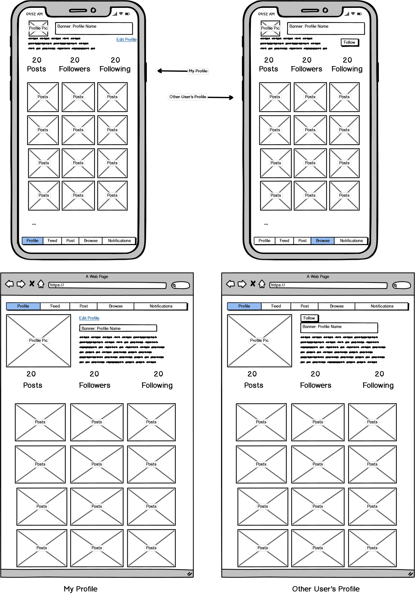
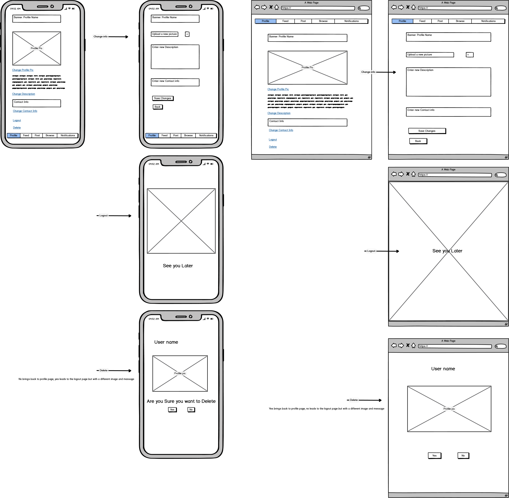
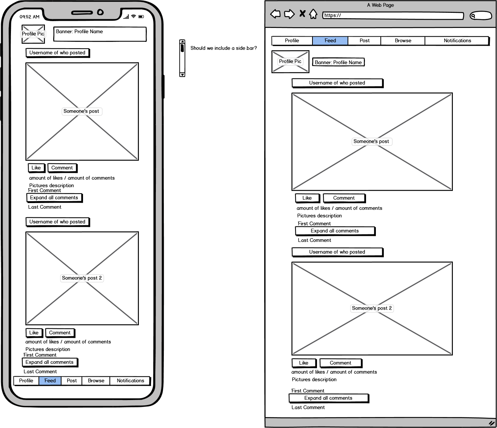
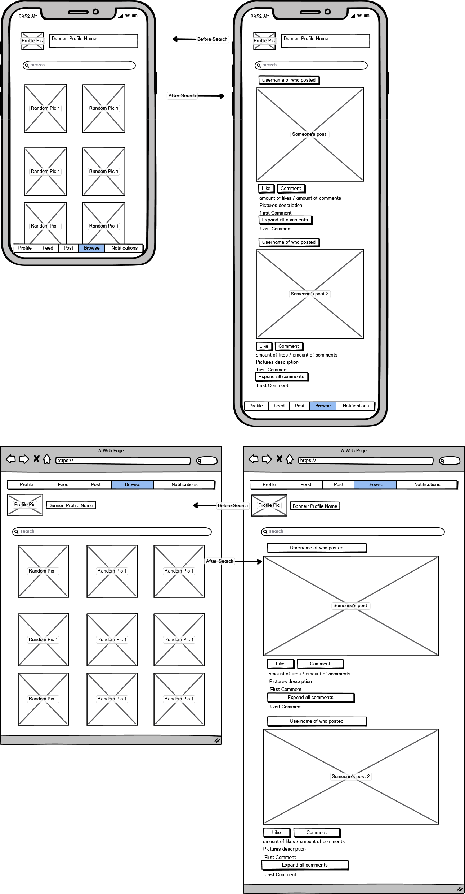
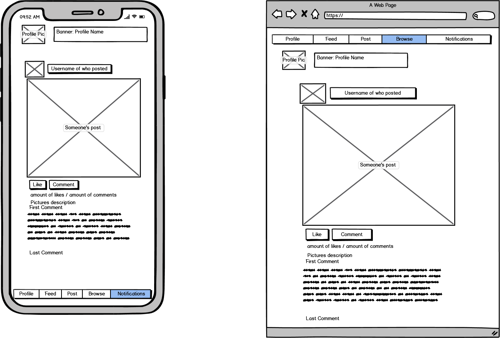
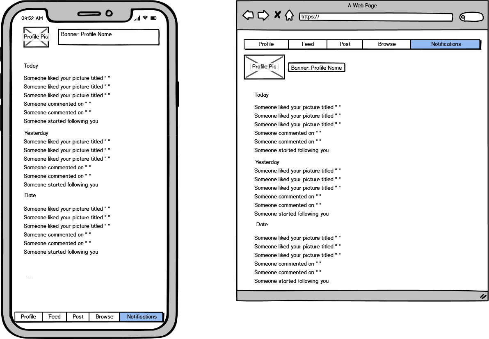

# Photo Sharing Application (Instagram Clone)

## Purpose

This will be a photo sharing app, similar to Instagram. User's will be able to sign up, create a profile. Once signed up, User's will be able to post pictures.
These picture's can be tagged with keys to later search through. People can then scroll through other people's pictures, like and comment on them. 

## Layout
**Sign-in/Create Page**

The first page will be a sign in page. The User will be prompted to enter a username/password which will lead to their profile if entered correctly.

If the User doesn't have an account and would like to create one instead. They will be able to with the create profile button.

This will take the User to a new page where they can create a profile name (this must be unique and will be the primary identifier for users), a profile picture to upload, a short description of themselves and some contact info (this will be private however to other users).

Below are the wireframes for both the mobile and desktop versions.

**Profile Page**

Once signed or profile is created, the user will be brought to the user's profile page. This will include their picture, name, short description at the top. Underneath will be a counter for all the posts they have made, The amount of profiles they follow as well as the amount that follows them. Underneath that will be a small version of all the pictures they have posted.

On the User's Profile page there will be a link to update/edit their profile however when viewing another profile (which will have the same format) that button will be replaced by a follow button.

The overall layout for the pages will have a navigation bar listing what page the user is on out of Profile, Feed, Browse, Notification and post. With the current pge being highlighted. This navigation bar will be at the bottom of the screen for mobile and at the top for desktop.

Wireframes are shown below.

**Edit Profile**

For the edit profile feature the User will be taken to a page similar to the create profile layout with links to edit the info. If these are clicked, the user will be take to a age with all the same headers over empty text boxes, these will be filled out and the changes will be updated.

On the edit page there will be an option to logout from the session which will lead to a page saying goodbye.

There will also be a delete profile option which the user can delete theyre profile. If clicked the user will be prompted to make sure this is what they want, if so the profile will be deleted and another page similar to the logout page will be shown with another goodbye message.

Wireframes are shown below.

**Feed**

This page will show latest pictures of people you follow. The format for pictures to scroll through will have the name of the profile who posted with their picture, underneath is the picture itself with an option to like or comment and if the user wants to see the profile, they can click on the name or the picture of the other user's profile above the picture. Underneath all that is the amount of likes and comments the picture has. Underneath that will be the description of the picture, then the first comment and the last comment. In between the two will be an option to expand and show all comments on a picture but the default will just show the first and last comment. There will be an option to just click the picture itself and expand it.

The layout is also the same from ere on where the users profile picture and name will be shown at the top of the page.

Wireframes are shown below.

**Browse**

This page will at first have some random pictures that the User can click on. There will also be a search bar. Once a search is made which will search keywords through the pictures and display pictures with the relevant keywords. This display format will greatly resemble the feed.

Wireframes are shown below.

**Clicking on a Picture**

When clicking on a picture, The user will be take to a page that is just focused on the picture itself. This will include all the relevant buttons and descriptions described above. The Navigation will remain on the browse feature when on this page.

Wireframes are shown below.

**Post**

This page will be to upload a new picture. There will be all empty fields for the user to fill out and an option for the user to upload a pictures.

Wireframes are Shown below.

**Notification**

This page will list all notifications. This will show if one of the pictures received a like or a comment and if the profile is followed the user will see this in their notification page. This app doesn't send any sort of push notifications so this page wil be where all of this is shown.

Wireframes are shown below

## Trello Board

https://trello.com/b/s5ovBbBQ/instagram
